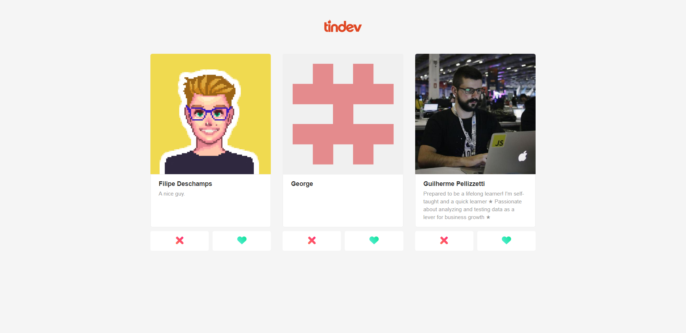

# TinDev Frontend

 

 

Projeto desenvolvido na semana OmniStack 8 da Rocketseat utilizando React JS.

## Objetivos

Os objetivos deste projeto são:

Introduzir os conceitos básicos do React JS.
Utilizar o NPM, Express, Routes, Axios e Socket IO Client (Web Socket).
Exemplificar utilização de serviços REST com React JS.

## Instalação

```bash
# Primeiramente clone o repositório 
https://github.com/JonasYo/tindev-frontend.git

# Navegue até o diretório
cd tindev-frontend

# Instale as dependências NPM
npm install
```

## Contribuições
Pull requests são bem-vindos.

## License
[MIT](https://choosealicense.com/licenses/mit/)
